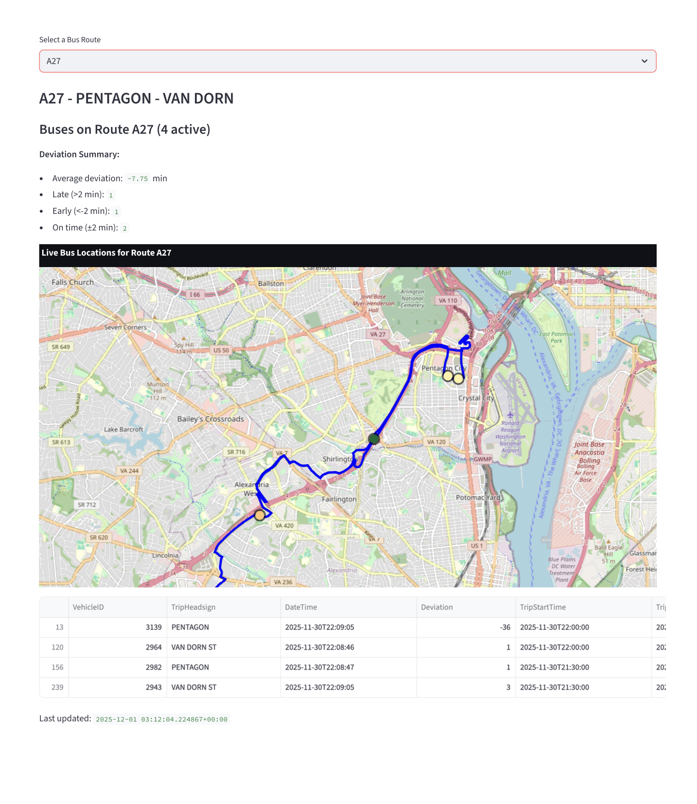

# Transit-Dash: Real-Time WMATA Bus Data Streaming & Visualization

**Team Members:**  
- Nyla Upal  
- Liam Ward

## Project Overview

Transit-Dash is a real-time data engineering project that ingests, processes, and visualizes live bus position data from the Washington Metropolitan Area Transit Authority (WMATA). The project demonstrates a modern streaming data pipeline using Redpanda (Kafka-compatible), DuckDB, Redis, and Streamlit, all orchestrated with Docker Compose.

This project was developed for DS3022 Data Project 3, focusing on integrating multiple data engineering tools, handling real-world streaming data, and generating actionable insights and visualizations.

---

## Data Source


# Transit-Dash: Real-Time WMATA Bus Data Streaming & Visualization

**Team Members:**  
- Nyla Upal  
- Liam Ward

## Project Overview

Transit-Dash is a real-time data engineering project that ingests, processes, and visualizes live bus position data from the Washington Metropolitan Area Transit Authority (WMATA). The project demonstrates a modern streaming data pipeline using Redpanda, DuckDB, Redis, and Streamlit, all orchestrated with Docker Compose.

This project was developed for DS3022 Data Project 3, focusing on integrating multiple data engineering tools, handling real-world streaming data, and generating actionable insights and visualizations.

---

## Data Source

- **WMATA Bus Positions API**:  
  - [API Docs](https://developer.wmata.com/docs/services/5476363f031f590f3809255b/operations/5476363f031f590d34cfc4f8)
  - Provides live bus locations, deviations, and trip metadata for the DC metro area.

---

## Architecture & Tools

- **Redpanda**: Streaming platform for ingesting bus data.
- **DuckDB**: Analytical database for storing and querying bus positions.
- **Streamlit + Plotly**: Interactive dashboard for real-time visualization and analysis.
- **Redis**: In-memory data store (future extensibility).
- **Docker Compose**: Container orchestration for reproducibility and easy setup.
- **Python**: Data ingestion, transformation, and dashboard logic.

**Pipeline Flow:**
1. **Producer** (`wm-producer.py`): Fetches live bus data from WMATA API and streams it to Redpanda.
2. **Consumer** (`wm-consumer.py`): Reads from Redpanda, transforms, and loads data into DuckDB.
3. **Dashboard** (`app.py`): Queries DuckDB and visualizes live bus positions, deviations, and route details.

---

## Key Features

- **Real-time streaming**: Ingests and processes thousands of records per hour.
- **Robust ETL**: Handles missing values, schema evolution, and API rate limits.
- **Interactive dashboard**: Visualizes bus locations, route shapes, and deviation statistics.

---

## Challenges & Solutions

- **API Rate Limits & Data Gaps**: Implemented error handling and retry logic in the producer.
- **Streaming Consistency**: Used Redpanda for reliable, high-throughput message delivery.
- **Data Quality**: Filtered out records with missing coordinates and handled schema changes.
- **Reproducibility**: Containerized all services and documented setup for easy replication.

---

## Insights & Findings

- **Deviation Analysis**: The dashboard summarizes average, late, early, and on-time bus deviations per route.
- **Route Trends**: Visualizations reveal which routes experience the most delays or early arrivals.
- **Real-World Relevance**: Insights can inform transit planners and riders about service reliability.

*Example Visualization:*


*Live map of bus positions and deviation summary for a selected route.*

---

## Setup & Usage

### Prerequisites

- [Docker & Docker Compose](https://docs.docker.com/get-docker/)
- [Python 3.8+](https://www.python.org/downloads/)
- WMATA API Key ([Get one here](https://developer.wmata.com/))

### 1. Clone the Repository

```bash
git clone https://github.com/liamward26/Transit-Dash.git
cd Transit-Dash
```

### 2. Configure API Keys

- Edit `wm-producer.py` and `app.py`:
  - Replace `API_KEY = ""` and `WMATA_API_KEY = ""` with your WMATA API key.

### 3. Start Services

```bash
docker-compose up -d
```

This will launch:
- Redpanda (Kafka cluster)
- Redpanda Console (web UI at [localhost:8080](http://localhost:8080))
- Redis

### 4. Run the Producer & Consumer

In separate terminalsL

```bash
# Terminal 1: Producer
python wm-producer.py
```

```bash
# Terminal 2: Consumer
python wm-consumer.py
```

### 5. Launch the Dashboard

```bash
streamlit run app.py
```

- Access the dashboard at [localhost:8501](http://localhost:8501)
- Select a route to view live bus positions, route shapes, and deviation statistics.

---

## Limitations & Future Work

- Only supports WMATA bus data; could be extended to other transit APIs.
- Further analysis (e.g., anomaly detection, predictive modeling) could be added.

---

## References & Resources

- [WMATA API Documentation](https://developer.wmata.com/)
- [Redpanda Docs](https://docs.redpanda.com/)
- [DuckDB Docs](https://duckdb.org/docs/)
- [Streamlit Docs](https://docs.streamlit.io/)
